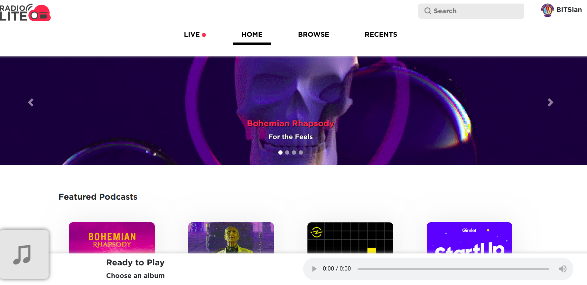
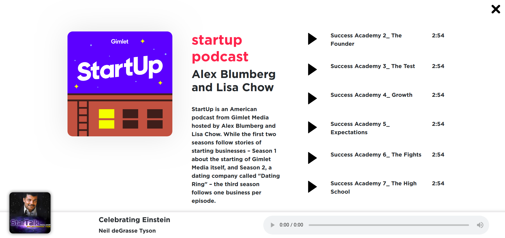

# Lan-Radio
A single-page dynamic streaming service for campus LAN Radio. Supports dynamic loading of content, live chat and much more! Feel free to use it for you college too!

The website landing page:

The podcast details popover page:
